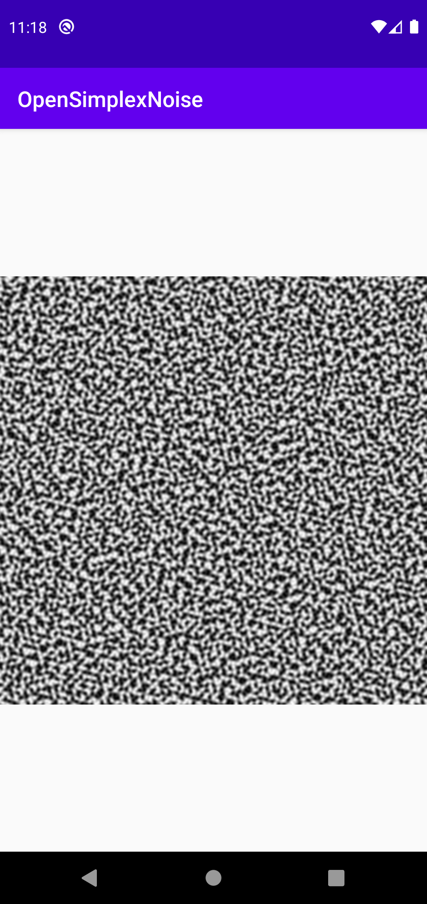

# OpenSimplexNoise
[](https://jitpack.io/#MarcoCiaramella/OpenSimplexNoise)

The Android library of the [OpenSimplex 2](https://github.com/KdotJPG/OpenSimplex2)
## How to import in your Android project
Add JitPack in your root build.gradle at the end of repositories:

```
allprojects {
  repositories {
    ...
    maven { url 'https://jitpack.io' }
  }
}
```

Add the dependency
```
dependencies {
  implementation 'com.github.MarcoCiaramella:OpenSimplexNoise:X.X.X'
}
```

## How to use
```java
import androidx.appcompat.app.AppCompatActivity;

import android.graphics.Bitmap;
import android.graphics.Color;
import android.os.Bundle;
import android.widget.ImageView;

import com.jnoise.opensimplexnoiselib.OpenSimplex2F;

public class MainActivity extends AppCompatActivity {

    @Override
    protected void onCreate(Bundle savedInstanceState) {
        super.onCreate(savedInstanceState);
        setContentView(R.layout.activity_main);

        int width = 512;
        int height = 512;
        double[] noise = createHeightmap(width, height, 0, 0, 0.1);
        int[] colors = new int[width*height];
        for (int i = 0; i < noise.length; i++){
            double d = (noise[i]+1.0) / 2.0;
            colors[i] = Color.argb(0xFF, (int)(0xFF*d), (int)(0xFF*d), (int)(0xFF*d));
        }
        Bitmap bitmap = Bitmap.createBitmap(colors, width, height, Bitmap.Config.ARGB_8888);
        ((ImageView)findViewById(R.id.imageView)).setImageBitmap(bitmap);
    }

    private static double[] points(int width, int height, int offX, int offY, double freq){
        double[] points = new double[width*height*2];
        int i = 0;
        for (int y = 0; y < height; y++) {
            for (int x = 0; x < width; x++) {
                double xd = (x + offX) * freq;
                double yd = (y + offY) * freq;
                points[i++] = xd;
                points[i++] = yd;
            }
        }
        return points;
    }

    public static double[] createHeightmap(int width, int height, int offX, int offY, double freq){
        OpenSimplex2F openSimplex2F = new OpenSimplex2F(1234);
        // create a width*height grid of points. Grid must be an array in the form of [x0,y0,x1,y1,....xn,yn]
        double[] grid = points(width, height, offX, offY, freq);
        return openSimplex2F.noise2(grid, grid.length/2);
    }
}
```
activity_main.xml
```xml
<?xml version="1.0" encoding="utf-8"?>
<FrameLayout xmlns:android="http://schemas.android.com/apk/res/android"
    xmlns:tools="http://schemas.android.com/tools"
    android:layout_width="match_parent"
    android:layout_height="match_parent"
    tools:context=".MainActivity">

    <ImageView
        android:id="@+id/imageView"
        android:layout_width="match_parent"
        android:layout_height="match_parent"
        android:scaleType="fitCenter" />
</FrameLayout>
```
